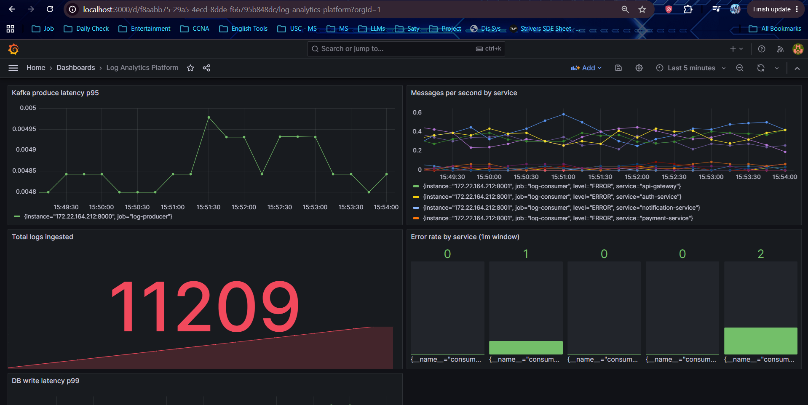

# 🚀 Kafka-Based Real-Time Log Analytics Platform

A **production-grade distributed log analytics pipeline** that ingests, processes, stores, and visualizes application logs in real time — built with the exact stack used by backend and platform engineering teams at companies like LinkedIn, Uber, and Confluent.

> **Stack:** Apache Kafka · Python · PostgreSQL · Redis · Prometheus · Grafana · Docker · Kubernetes

---

## 📊 Live Dashboard



*Real-time Grafana dashboard showing 11,000+ logs ingested, per-service error rates, p95 Kafka produce latency, and p99 PostgreSQL write latency.*

---

## 🏗️ Architecture

```
                        ┌─────────────────────────────────────────────┐
                        │            Docker / Kubernetes               │
                        │                                              │
  ┌──────────────┐      │   ┌─────────────┐    ┌──────────────────┐  │
  │ Log Producer │──────┼──►│    Kafka    │───►│  Log Consumer    │  │
  │  (Python)    │      │   │  + Zookeeper│    │   (Python)       │  │
  │              │      │   └─────────────┘    └───────┬──────────┘  │
  │ /metrics     │      │                              │              │
  │ :8000        │      │                    ┌─────────┴──────────┐  │
  └──────────────┘      │                    │                    │  │
                        │             ┌──────▼──────┐    ┌───────▼─┐ │
                        │             │ PostgreSQL  │    │  Redis  │ │
                        │             │ (log store) │    │(counters│ │
                        │             └─────────────┘    └─────────┘ │
                        │                                             │
                        │   ┌─────────────┐    ┌─────────────────┐  │
                        │   │ Prometheus  │───►│    Grafana      │  │
                        │   │ (scrapes    │    │  (dashboards)   │  │
                        │   │  /metrics)  │    │   :3000         │  │
                        │   └─────────────┘    └─────────────────┘  │
                        └─────────────────────────────────────────────┘
```

**Data flow:**
1. **Log Producer** generates realistic application logs (INFO/WARNING/ERROR) across 5 simulated microservices and publishes them to a Kafka topic at ~2 messages/sec
2. **Apache Kafka** durably buffers messages, decoupling the producer from the consumer
3. **Log Consumer** reads from Kafka, persists structured logs to PostgreSQL, and updates real-time counters in Redis
4. **Prometheus** scrapes `/metrics` endpoints on both services every 15 seconds
5. **Grafana** visualizes throughput, latency histograms, and error rates in real time

---

## 🛠️ Tech Stack

| Technology | Role | Why This Tool |
|---|---|---|
| **Apache Kafka** | Message broker | Decouples producers from consumers; handles high-throughput ingestion with durability guarantees |
| **Python** | Producer & Consumer | Fast iteration; rich ecosystem for Kafka, PostgreSQL, and Redis clients |
| **PostgreSQL** | Log storage | Structured queries on logs by service, level, and timestamp; indexed for fast lookups |
| **Redis** | Real-time counters | In-memory increments per message — 100x faster than hitting PostgreSQL on every write |
| **Prometheus** | Metrics collection | Pull-based scraping from `/metrics` endpoints; stores time-series data |
| **Grafana** | Dashboards | Real-time visualization of throughput, latency, and error rate panels |
| **Docker Compose** | Local orchestration | Entire 8-service stack starts with a single command |
| **Kubernetes** | Production orchestration | Deployments, Services, ConfigMaps, HPA for scalable production deployment |

---

## ✨ Key Features

- **End-to-end pipeline** — logs flow from producer → Kafka → consumer → PostgreSQL in real time
- **Structured observability** — Prometheus metrics with latency histograms (p95/p99), throughput counters, and per-service error rates
- **Real-time aggregates** — Redis maintains sliding 60-second error rate windows per service, updated on every message
- **Production-like config** — `acks=all`, gzip compression, consumer groups, auto offset commit
- **Environment-aware** — services read connection config from environment variables, falling back to localhost for local dev
- **One-command startup** — entire stack (8 containers) starts with `docker-compose up -d`
- **Kubernetes-ready** — manifests for Namespace, ConfigMap, Secrets, Deployments, Services, and HPA

---

## 🚀 Quick Start

### Prerequisites
- Docker + Docker Compose
- Python 3.11+ (optional — only needed for running scripts outside Docker)

### Start the full stack

```bash
git clone <your-repo-url>
cd Log_Analytics_Platform
docker-compose up -d
```

This starts all 8 services automatically:

| Container | Port | Description |
|---|---|---|
| Zookeeper | 2181 | Kafka coordination |
| Kafka | 9092 | Message broker |
| PostgreSQL | 5432 | Log storage |
| Redis | 6379 | Real-time counters |
| Prometheus | 9090 | Metrics scraping |
| Grafana | 3000 | Dashboards |
| Log Producer | 8000 | Generates and publishes logs |
| Log Consumer | 8001 | Consumes logs, writes to DB |

### Access the dashboards

| Service | URL | Credentials |
|---|---|---|
| **Grafana** | http://localhost:3000 | admin / admin |
| **Prometheus** | http://localhost:9090 | — |
| **Producer metrics** | http://localhost:8000/metrics | — |
| **Consumer metrics** | http://localhost:8001/metrics | — |

### Verify the pipeline

**Logs in PostgreSQL:**
```bash
docker exec -it postgres psql -U loguser -d loganalytics -c \
  "SELECT service, level, COUNT(*) FROM logs GROUP BY service, level ORDER BY 3 DESC;"
```

**Real-time counters in Redis:**
```bash
docker exec -it redis redis-cli GET logs:total
docker exec -it redis redis-cli ZREVRANGE logs:endpoints:hits 0 -1 WITHSCORES
```

**Kafka topic:**
```bash
docker exec -it kafka kafka-topics --bootstrap-server localhost:9092 --list
```

---

## 📈 Grafana Dashboard Panels

| Panel | Prometheus Query | What It Shows |
|---|---|---|
| **Messages/sec by service** | `rate(consumer_messages_total[1m])` | Live throughput per service and log level |
| **Error rate by service** | `consumer_error_rate_1m` | Per-service errors in the last 60s sliding window |
| **DB write latency p99** | `histogram_quantile(0.99, rate(consumer_db_write_duration_seconds_bucket[1m]))` | 99th percentile PostgreSQL write latency |
| **Total logs ingested** | `sum(consumer_messages_total)` | Running total of all logs processed |
| **Kafka produce latency p95** | `histogram_quantile(0.95, rate(producer_send_duration_seconds_bucket[1m]))` | 95th percentile Kafka send latency |

---

## 📡 Prometheus Metrics

**Producer** (`:8000/metrics`):

| Metric | Type | Description |
|---|---|---|
| `producer_messages_total{level, service}` | Counter | Messages successfully sent to Kafka |
| `producer_send_duration_seconds` | Histogram | End-to-end Kafka send latency |
| `producer_errors_total` | Counter | Failed Kafka send attempts |

**Consumer** (`:8001/metrics`):

| Metric | Type | Description |
|---|---|---|
| `consumer_messages_total{level, service}` | Counter | Messages consumed from Kafka |
| `consumer_db_write_duration_seconds` | Histogram | PostgreSQL write latency |
| `consumer_redis_write_duration_seconds` | Histogram | Redis pipeline write latency |
| `consumer_error_rate_1m{service}` | Gauge | Per-service error rate (60s sliding window) |
| `consumer_processing_errors_total` | Counter | Unhandled processing failures |

---

## 📁 Project Structure

```
Log_Analytics_Platform/
├── producer/
│   ├── producer.py          # Generates realistic logs, publishes to Kafka
│   ├── Dockerfile           # Containerized producer service
│   └── requirements.txt
├── consumer/
│   ├── consumer.py          # Kafka consumer → PostgreSQL + Redis
│   ├── Dockerfile           # Containerized consumer service
│   └── requirements.txt
├── prometheus/
│   └── prometheus.yml       # Scrape config targeting producer and consumer
├── k8s/
│   ├── 00-namespace.yaml    # log-analytics namespace
│   ├── 01-configmap.yaml    # Shared config + secrets
│   ├── 02-producer.yaml     # Producer Deployment + Service + HPA
│   └── 03-consumer.yaml     # Consumer Deployment + Service + HPA
├── assets/
│   └── grafana-dashboard.png
└── docker-compose.yml       # Full 8-service stack
```

---

## ☸️ Kubernetes

Manifests in `k8s/` cover production-like deployment:

```bash
kubectl apply -f k8s/
kubectl get pods -n log-analytics
kubectl get hpa -n log-analytics
```

**What's included:**
- `Namespace` — isolated `log-analytics` namespace
- `ConfigMap` — Kafka bootstrap servers, PostgreSQL and Redis connection config
- `Secret` — database credentials
- `Deployment` — producer (2 replicas) and consumer (3 replicas)
- `Service` — internal networking for metrics scraping
- `HorizontalPodAutoscaler` — consumer scales from 2→10 pods at 60% CPU; producer scales 1→5 at 70% CPU

---

## 🔬 Design Decisions

**Why Kafka instead of just writing directly to PostgreSQL?**
Kafka decouples the producer from the consumer. If the database goes down, logs buffer in Kafka and are processed when it comes back — no data loss. It also allows multiple consumers to read the same topic independently (e.g. one for storage, one for alerting).

**Why Redis for counters instead of PostgreSQL?**
Redis handles thousands of increments per second in memory. Hitting PostgreSQL on every single log message would create write contention at scale. Redis pipelines batch multiple commands in one round trip, keeping latency under 1ms.

**Why `acks=all` on the producer?**
Ensures Kafka acknowledges a message only after all in-sync replicas have written it — no message loss even if a broker fails immediately after receiving a message.

---
